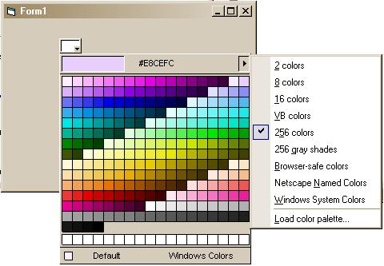



## AvalonSoft ColorPicker \(small bug fix\)

### Description

A color-picker control cloning the one used in Dreamweaver. This is a custom made color-picker, cloning the one used in Dreamweaver. This is my first posting here, so be gentile :)! Code taken from Abdul Gafoor and Steve McMahon. Lots of APIs, custom controls, custom menus, etc. Hope u guys like it! Please send feedback to make this control better! You must have and register ssubtmr6.dll from VBAccelerator.com. Sorry about that.
 
### More Info
 

             |
---                |---
**Submitted On**   |2004-05-02 20:41:44
**By**             |[Alin Haidau](https://github.com/Planet-Source-Code/PSCIndex/blob/master/ByAuthor/alin-haidau.md)
**Level**          |Advanced
**User Rating**    |5.0 (10 globes from 2 users)
**Compatibility**  |VB 6\.0
**Category**       |[Custom Controls/ Forms/  Menus](https://github.com/Planet-Source-Code/PSCIndex/blob/master/ByCategory/custom-controls-forms-menus__1-4.md)
**World**          |[Visual Basic](https://github.com/Planet-Source-Code/PSCIndex/blob/master/ByWorld/visual-basic.md)
**Archive File**   |[AvalonSoft1750435262004\.zip](https://github.com/Planet-Source-Code/alin-haidau-avalonsoft-colorpicker-small-bug-fix__1-54028/archive/master.zip)

